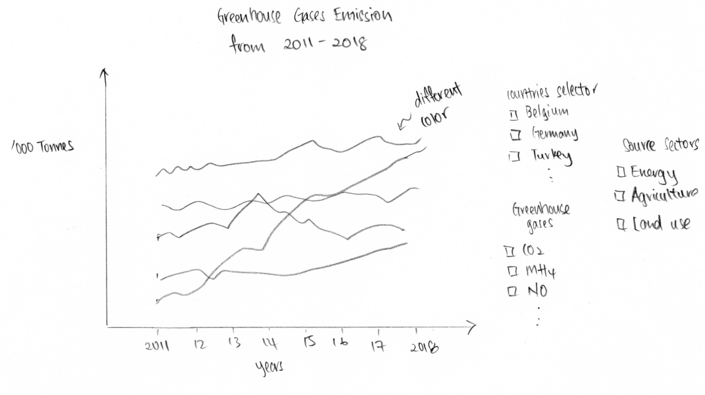
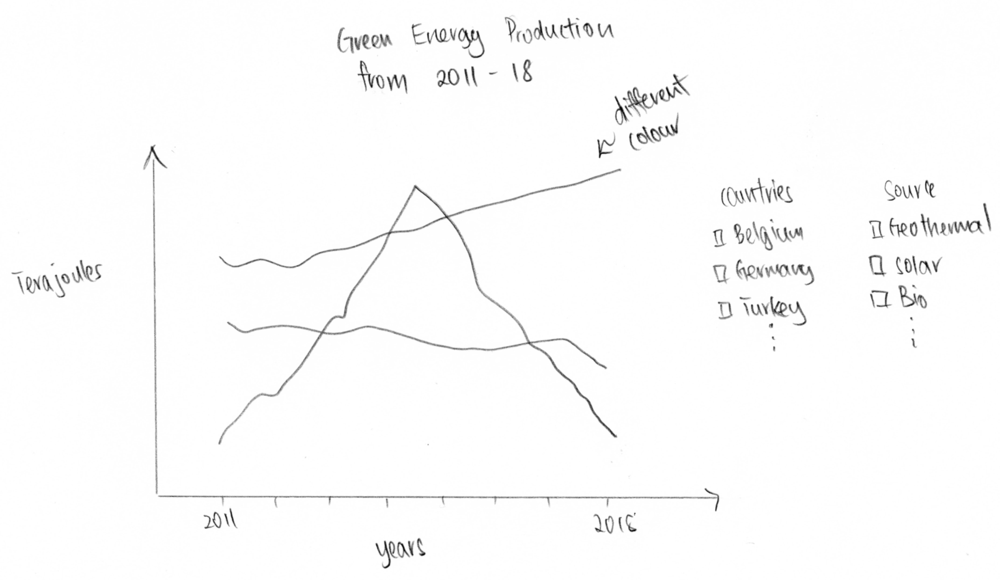
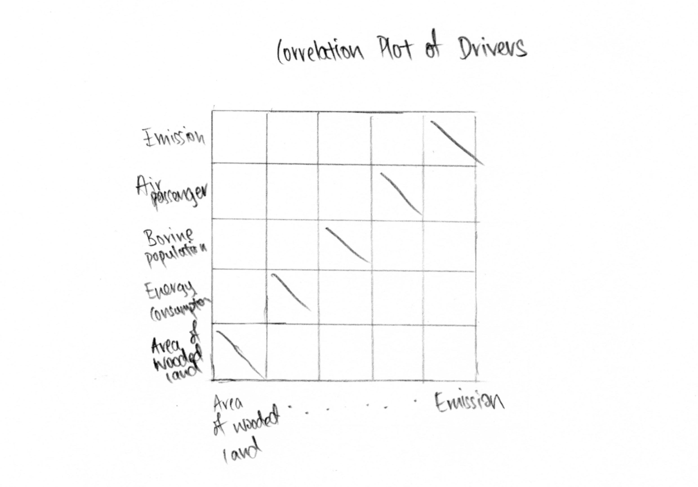
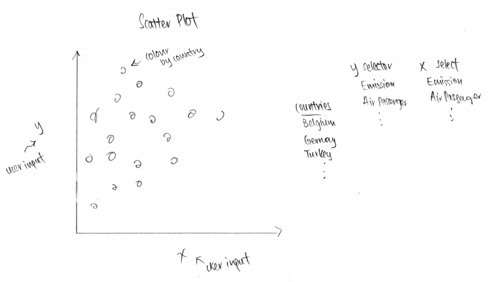
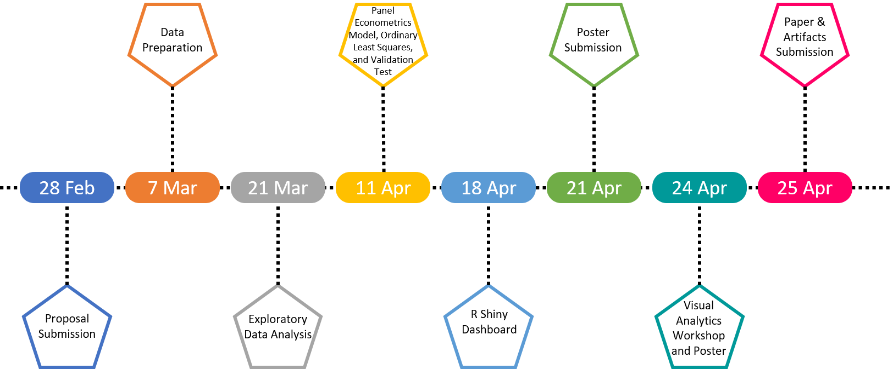

<style>
h1, h2, h3 {
text-align: left
}
body {
text-align: justify}
</style>

```{r setup, include=FALSE}
knitr::opts_chunk$set(echo = FALSE)
```

### Background
Global warming is expected to result in a rise of the average global temperature between 1.1 to 6.4 degree celsius over the century, if there are no interventions taken to reduce emissions of greenhouse gases. Greenhouse gases are contributed by multiple drivers which include economic activities such as electricity production, transportation and waste generation.

In December 2020, the European Union (EU) leaders committed to an ambitious goal of reducing greenhouse gases by 55% by 2030 to tackle climate change. The EU is currently the world's third biggest emitter of greenhouse gases. Measures were introduced to mitigate the greenhouse gas emissions produced by economic activities, such as emission taxes and use of renewable energy sources.

### Motivation
A large amount of climate change related statistics are available on Eurostat, with data across multiple domains such as environmental, social and economic statistics. Monitoring of the reduction of greenhouse gas emissions can be performed and is essential for tracking EU's progress towards achieving its 2030 goal. Analysis of the impacts of the drivers and mitigation using the available statistics also allowed for insights on the determinants of the greenhouse gas emissions for the EU countries.

### Broad Data Description
Statistics from Eurostat covering a wide range of domains are used in this R Shiny Application. For our project, we will focus on datasets under greenhouse gas emissions, drivers and mitigation for all EU countries.

### Project Objectives
The project aims to deliver an R-Shiny app that provides interactive user interface design to:

* Understand the correlation of factors affecting greenhouse gas emissions
* Identify important factors which contributes to greenhouse gas emissions using Panel data regression
* Further analyse the difference in greenhouse gas emissions by country and time period


### Proposed Scope and Methodology

### Storyboard & Visualization Features

#### Exploratory Data Analysis

Data|Proposed Visualisation
:-|:---
Greenhouse Gases Emission|{width=100%}
Green Energy Production|{width=100%}
Correlation Plot of Drivers|{width=100%}
Scatter Plot|{width=100%}


#### Validation Tests

#### Calibration of Model

### Proposed R Packages
#### Data Preparation
* tidyverse: https://www.tidyverse.org

#### Panel data regression
* ExPanDaR: https://cran.r-project.org/web/packages/ExPanDaR
* plm: https://cran.r-project.org/web/packages/plm

#### Building Shiny App
* shiny: https://shiny.rstudio.com
* shinythemes: https://cran.r-project.org/web/packages/shinythemes
* shinyWidgets: https://cran.r-project.org/web/packages/shinyWidgets
* RColorBrewer: https://cran.r-project.org/web/packages/RColorBrewer

### Project Timeline

{width=100%}

### Team Members
* Choong Shi Lian Selene
* Jiang Weiling Angeline
* Wong Wei Sheng Dylan

### References
* [Climate change: EU leaders set 55% target for CO2 emissions cut](https://www.bbc.com/news/world-europe-55273004)
* [Combating climate change: Fact sheet](https://www.europarl.europa.eu/factsheets/en/sheet/72/climate-change-and-the-environment#:~:text=The%20European%20Union%20(EU)%20is,a%2040%25%20cut%20by%202030) 