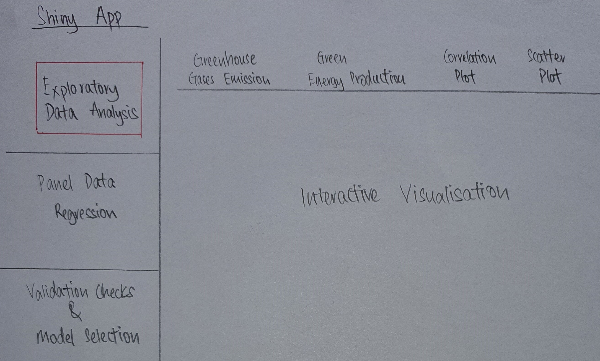
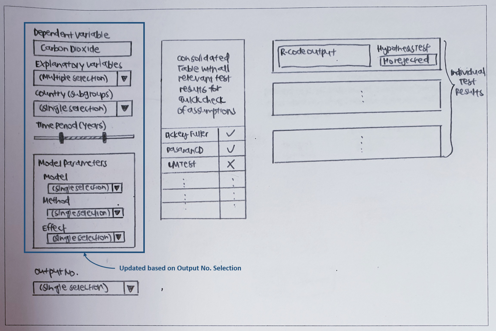

<style>
h1, h2, h3 {
text-align: left
}
body {
text-align: justify}
</style>

```{r setup, include=FALSE}
knitr::opts_chunk$set(echo = FALSE)
```

### Background
Global warming is expected to result in a rise of the average global temperature between 1.1 to 6.4 degree celsius over the century, if there are no interventions taken to reduce emissions of greenhouse gases. Greenhouse gases are contributed by multiple drivers which include economic activities such as electricity production, transportation and waste generation. Carbon dioxide is the primary greenhouse gas emitted through human activities.

In December 2020, the European Union (EU) leaders committed to an ambitious goal of reducing greenhouse gases by 55% by 2030 to tackle climate change. The EU is currently the world's third biggest emitter of greenhouse gases. Measures, such as emission taxes and use of renewable energy sources, were introduced to mitigate the greenhouse gas emissions, especially carbon dioxide emissions.

### Motivation
A large amount of climate change related statistics are available on Eurostat, with data across multiple domains such as environmental, social and economic statistics. Monitoring of the reduction of greenhouse gas emissions can be performed and is essential for tracking EU's progress towards achieving its 2030 goal. Analysis of the impacts of the drivers and mitigation using the available statistics also allowed for insights on the determinants of the greenhouse gas emissions for the EU countries.

### Project Objectives
The project aims to deliver an R-Shiny app that provides interactive user interface design to:

* Understand the correlation of factors affecting greenhouse gas emissions
* Further analyse the difference in greenhouse gas emissions by country and time period
* Identify important factors which contributes to greenhouse gas emissions from cross-sectional view using Ordinary Least Square regression and from panel data view using Panel data regression

### Broad Data Description
Statistics from Eurostat covering a wide range of domains are used in this R Shiny Application. For our project, we will focus on datasets under greenhouse gas emissions, drivers and mitigation for all EU countries. 

### Proposed Scope and Methodology
1. Analysis of Eurostat greenhouse emission dataset with background research
2. Exploratory Data Analysis (EDA) methods in R
3. Analysis of Ordinary Least Square regression in R
4. Analysis of Panel data regression in R
5. Development of validating checks and model selection in R for both Ordinary Least Square and Panel regression
6. R-Shiny app development for user interactivity

A generalized development timeframe for this project is shown below:

```{r, echo=FALSE, message=FALSE, out.width="100%", out.height="100%"}
library(knitr)
library(png)
timeline_path <- "./image/timeline.png"
include_graphics(timeline_path)
```

### Storyboard & Visualization Features

### (A) Exploratory Data Analysis (EDA) methods in R

The proposed layout of the R Shiny app consists of 3 main tabs in the tab panel

{width=100%}

Under the EDA tab, there will be another tab panel comprising of 4 tabs shown below:

Data|Proposed Visualisation
:-:|:---:
Greenhouse Gases Emission|{width=100%}
Green Energy Production|{width=100%}
Correlation Plot of Drivers and Mitigation|{width=100%}
Scatter Plot for Drivers and Mitigation|{width=100%}

### (B) Analysis of Ordinary Least Square regression in R

The following shows the proposed first module under OLS regression where users can explore different methods to determine the set of predictors for their model. Proposed type of visualization and rationales are as follow: 

```{r, echo=FALSE, message=FALSE, out.width="100%", out.height="100%"}
library(knitr)
library(png)
ols1_path <- "./image/OLS_1.png"
include_graphics(ols1_path)
```

Thereafter, users will input their preferred dependent and independent variables to generate the regression estimations. At the same time, a series of validation/assumption checks will be in place for the users to determine if the chosen model is appropriate.

```{r, echo=FALSE, message=FALSE, out.width="100%", out.height="100%"}
library(knitr)
library(png)
ols2_path <- "./image/OLS_2.png"
include_graphics(ols2_path)
```

### (C) Analysis of Panel data regression in R

```{r, echo=FALSE, message=FALSE, out.width="100%", out.height="100%"}
library(knitr)
library(png)
panel1_path <- "./image/Panel_1.png"
include_graphics(panel1_path)
```

If user(s) prefers to see in terms of bar chart i.e. "Bar" is selected under the View option.

```{r, echo=FALSE, message=FALSE, out.width="100%", out.height="100%"}
library(knitr)
library(png)
panel2_path <- "./image/Panel_2.png"
include_graphics(panel2_path)
```

**Development of validating checks and model selection in R** 

To cater to varying statistical knowledge of users, there will be two types of outputs shown - (1) simplified overview of whether the assumptions for the calibrated model is met and (2) detailed outputs from each validation tests.

```{r, echo=FALSE, message=FALSE, out.width="100%", out.height="100%"}

```

The list of validation tests for the panel models include:

 - Test of **poolability** using Chow test
 - Tests for **individual and time effects** using Lagrange multiplier test
 - Test for **correlation between unobserved effects and the regressors** using Hausman-type test
 - Test for **stationarity of the series** using Augmented Dickey-Fuller (ADF)
 - Test for **cross-sectional dependence** using the Pesaran CD test of independence

### Proposed R Packages
#### Data Preparation
* tidyverse: https://www.tidyverse.org

#### Ordinary Least Square regression
* olsrr: https://cran.r-project.org/web/packages/olsrr/index.html
* jtools: https://cran.r-project.org/web/packages/jtools/index.html
* ggstatsplot: https://cran.r-project.org/web/packages/ggstatsplot/index.html
* ggstance: https://cran.r-project.org/web/packages/ggstance/index.html

#### Panel data regression
* ExPanDaR: https://cran.r-project.org/web/packages/ExPanDaR
* plm: https://cran.r-project.org/web/packages/plm
* stargazer: https://cran.r-project.org/web/packages/stargazer
* tseries: https://cran.r-project.org/web/packages/tseries

#### Building Shiny App
* shiny: https://shiny.rstudio.com
* shinythemes: https://cran.r-project.org/web/packages/shinythemes
* shinyWidgets: https://cran.r-project.org/web/packages/shinyWidgets
* RColorBrewer: https://cran.r-project.org/web/packages/RColorBrewer

### Team Members
* Choong Shi Lian Selene
* Jiang Weiling Angeline
* Wong Wei Sheng Dylan

### References
* [Climate change: EU leaders set 55% target for CO2 emissions cut](https://www.bbc.com/news/world-europe-55273004)
* [Combating climate change: Fact sheet](https://www.europarl.europa.eu/factsheets/en/sheet/72/climate-change-and-the-environment#:~:text=The%20European%20Union%20(EU)%20is,a%2040%25%20cut%20by%202030)
* [Overview of Greenhouse Cases: Carbon Dioxide](https://www.epa.gov/ghgemissions/overview-greenhouse-gases)