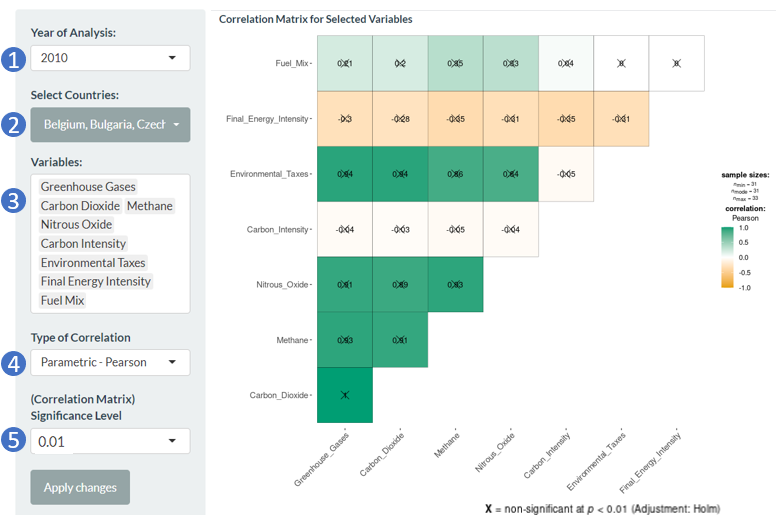

```{r setup, include=FALSE}
knitr::opts_chunk$set(echo = FALSE)
```

# Shiny Application

- DEGGED is available on [shinyapps.io](https://slchoong.shinyapps.io/isss608group02_degged/).
- The source code and data are made available at [GitHub.com](https://github.com/awljiang/bloggy).

# User Guide for DEGGED

From the main navigation bar, select any of the following tabs to navigate and several tabs have further drop-downs. A quick overview of the different components can be found under the Overview Page.

## 1.0 Overview Page

This page shows a short description of the application along with an overview of the components included in the application.

```{r, echo=FALSE, message=FALSE}
knitr::include_graphics("images/overview.JPG")
```

## 2.0 Data Overview

This tab provides users with an overview of the data used. The selection options on the left panel apply to all the tabs within the tab.

```{r, echo=FALSE, message=FALSE}

```

(1) Select the range of Years to be included

(2) Select the countries of interest by clicking on each country to check or uncheck the selection. Click on the Select All button to select all the countries and the Deselect All button to clear all selection.

(3) Click "Apply changes" to filter the dataset.

The Data tab allows users to explore the data.

```{r, echo=FALSE, message=FALSE}
knitr::include_graphics("images/data.png")
```

(1) Search for values with the data using the Search bar

(2) Search for rows with specific value for each column using the Search bar at the top of each column

(3) Select the number of entries to display in 1 page

(4) Click to navigate to the respective pages, or previous and next page.

As for the Missing Data tab, it allows users to detect the presence of missing data for which country and which variable.


## 3.0 Exploratory Data Analysis

Under the Exploratory Data Analysis tab of the main navigation bar, there are four drop-downs namely "Descriptive Analysis", "Time Trend", "Correlation Matrix" and "Scatterplot". More details on each drop-down tab are detailed in the next few sections. 

### 3.1 Descriptive Analysis

This tab provides some descriptive statistics on the data. The selection options on the left panel apply to all the tabs within the tab.

```{r, echo=FALSE, message=FALSE}

```

(1) Select the range of Years to be included.

(2) Select the countries of interest by clicking on each country to check or uncheck the selection. Click on the Select All button to select all the countries and the Deselect All button to clear all selection.

(3) Select the variables of interest. Multiple variables can be selected. To remove a variable from the selected list, use backspace on keyboard to delete it.

(4) Select the number of bins for histogram plot.

(5) Click "Apply changes" to compute the output and plot the chart.

Two tabs are included as part of this tab - Summary Statistics and Histogram. 

For the Histogram Chart, users can hover over the bars and a tooltip will appear containing the count of records with the indicated value.

```{r, echo=FALSE, message=FALSE}

```

### 3.2 Time Trend

This tab shows the changes in trend across the years. The selection options on the left panel allows users to customise the view.

```{r, echo=FALSE, message=FALSE}

```

(1) Select the range of Years to be included. The range of Years is recommended to be kept to a minimum range of at least 3 years to prevent the truncation of the years.

(2) Select the countries of interest by clicking on each country to check or uncheck the selection. Click on the Select All button to select all the countries and the Deselect All button to clear all selection.

(3) Select whether to display the time trends as individual countries or at the grouped level.

(4) This option will only appear if "Individual" is selected for Individual or Grouped. Select the variable to be shown. Only 1 variable can be chosen to be displayed at each time.

(5) Click "Apply changes" to update the time trend plot.

For both the chart at Individual level, users can hover over points on each line and a tooltip will appear containing more information such as the country, year and value of the selected variable. As for the grouped level, users can hover over the middle circular points on each line and a tooltip will appear containing more information such as the mean, value of the variable and year.

```{r, echo=FALSE, message=FALSE}

```


### 3.3 Correlation Matrix

This tab shows the correlation values between each variable pair. The selection options on the left panel allows users to customise the data to be included in the view.

```{r, echo=FALSE, message=FALSE}

```

(1) Select the Year to be included. Only 1 year can be selected.

(2) Select the countries of interest by clicking on each country to check or uncheck the selection. Click on the Select All button to select all the countries and the Deselect All button to clear all selection.

(3) Select the variables of interest. Multiple variables can be selected. To remove a variable from the selected list, use backspace on keyboard to delete it.

(4) Select the type of correlation coefficient is to be computed. The options are Pearson, Spearman and Robust.

(5) Select the significance level (0.01, 0.05, 0.1) for the matrix.

(6) Click "Apply changes" to update the chart.


### 3.4 Scatterplot

This tab allows users to determine the empirical relationship between two variables. The selection options on the left panel allows users to customise the variables included in the view of the plot.

```{r, echo=FALSE, message=FALSE}

```

(1) Select the range of Years to be included.

(2) Select the countries of interest by clicking on each country to check or uncheck the selection. Click on the Select All button to select all the countries and the Deselect All button to clear all selection.

(3) Select the X-variable of interest. Only 1 variable can be selected.

(4) Select the Y-variable of interest to be plotted against X. Only 1 variable can be selected.

(5) Click "Apply changes" to update the chart.

Users can also hover the chart elements (scatterplot points, line and band) and a tooltip containing information on the hovered point will be shown.


## 4.0 Ordinary Least Square (OLS) Regression

Under the Ordinary Least Square Regression tab of the main navigation bar, there are two drop-downs namely "Variable Selection" and "Model Selected". More details on each drop-down tab are detailed in the next few sections. 

### 4.1 Variable Selection

This tab allows users to explore the best subset of predictors to include in the model, among all possible subsets of predictors. The selection options on the left panel apply to all the tabs within the tab.

```{r, echo=FALSE, message=FALSE}

```

(1) Select the dependent variable among the 4 greenhouse gas types. Only 1 selection is allowed. 

(2) Select the independent variables of interest. Multiple variables can be selected. To remove a variable from the selected list, use backspace on keyboard to delete it.

(3) Select the range of Years to be included. Only 1 year is allowed to be selected.

(4) Select the method to perform for variable selection among the 6 options - "Stepwise AIC forward", "Stepwise AIC backward", "Stepwise AIC both", "Stepwise BIC forward", "Stepwise BIC backward", "Stepwise BIC both"

(5) Click "Apply changes".

Three tabs are included as part of this tab - Summary, Plot and Detailed Output. These tabs will display the outputs of the OLS model in different forms. User can toggle between the tabs to view their preferred way for interpreting the results of the variable selection.

Guide has been included in each tab on how to interpret the output/ plot. 


### 4.2 Model Selected

This tab allows users to analyse the outputs of the selected model, along with validating any violation of assumptions. For the selection options on the left panel, the first 3 selections (Dependent Variable, Independent Variable and Year of Analysis) apply to all the tabs within the tab while the remaining selections allows users to select the preferred test option for each assumption.

```{r, echo=FALSE, message=FALSE}

```

(1) Select the dependent variable among the 4 greenhouse gas types. Only 1 selection is allowed. 

(2) Select the independent variables of interest. Multiple variables can be selected. To remove a variable from the selected list, use backspace on keyboard to delete it.

(3) Select the range of Years to be included. Only 1 year is allowed to be selected.

(4) Select the preferred choice for heteroskedasticity test.

(5) Select the preferred choice for residual diagnostics.

(6) Select the preferred choice for collinear diagnostics.

(7) Select the preferred choice for model fit assessment.

(8) Click "Apply changes".

Six tabs are included as part of this tab - Output (Table), Output (Plot), Heteroskedasticity Test, Residual Diagnostics, Collinear Diagnostics and Model Fit Assessment. 

The first two tabs in this tab (Output in Table and Plot) will display the outputs of the selected OLS model in tabular and visualised forms. User can toggle between these tabs to view their preferred way for interpreting the results of the OLS model.

The Heteroskedasticity Test, Residual Diagnostics and Collinear Diagnostics tab display the respective outputs for each assumption test, while the Model Fit Assessment tab allows users to visually assess the fit of the OLS model. 

Guide has been included in each tab on how to interpret the output/ plot. 


## 5.0 Panel Data Regression

Under the Panel Data Regression tab of the main navigation bar, there are two drop-downs namely "Model Building" and "Tests for Assumptions". More details on each drop-down tab are detailed in the next few sections. 

### 5.1 Model Building

This tab allows users to construct the panel data regression model of interest. The selection options on the left panel apply to all the tabs within the tab.

```{r, echo=FALSE, message=FALSE}

```

(1) Select the range of Years to be included.

(2) Select the countries of interest by clicking on each country to check or uncheck the selection. Click on the Select All button to select all the countries and the Deselect All button to clear all selection. For panel model, more than 1 country should be selected.

(3) Select the dependent variable among the 4 greenhouse gas types. Only 1 selection is allowed.

(4) Select the independent variables of interest. Multiple variables can be selected. To remove a variable from the selected list, use backspace on keyboard to delete it.

(5) Select the model type between "Fixed Effect" and "Random Effect" to run.

(6) Select the effects of "Individual", "Time" or "Two-ways" to use for the model.

(7) This option will only appear if "Random Effect" is selected for Model Type. Select the computation method among the 4 methods for the random model.

(8) This option will only appear if "Random Effect" is selected for Model Type, and is meant for the Model Fit Assessment. Select the type for the Lagrange Multiplier Test among the 3 types.

(9) Click "Apply changes" to generate the output of the constructed panel model.

Four tabs are included as part of this tab - Summary, Plot, Detailed Output and Model Fit Assessment. 

The first three tabs in this tab (Summary, Plot and Detailed Output) will display the outputs of the constructed panel model in different forms. User can toggle between the tabs to view their preferred way for interpreting the results of the panel model.

The Model Fit Assessment tab performs the relevant statistical tests to determine the most appropriate model type. When "Fixed Effect" is selected for Model Type, Hausman Test and Chow Test of Poolability will be performed to assess fixed effect against random and pooled effect respectively. When "Random Effect" is selected for Model Type, Hausman Test and Lagrange Multiplier Test will be performed to assess random effect against fixed and pooled effect respectively. 

Guide has been included in each tab on how to interpret the output/ plot. 


### 5.2 Tests for Assumptions

This tab allows users to assess if the data complies with the assumptions of panel data regression. The selection options on the left panel allows users to select the preferred test option for each assumption.

```{r, echo=FALSE, message=FALSE}

```

(1) Select the preferred plot for assessing any violation of normality assumption. Users can choose between "Residual QQ-plot", "Residual vs Fitted Value Plot" or "Residual Histogram".

(2) Select the preferred statistical test for assessing preference of any serial correlation. Users can choose between "Unobserved Effect Test", "Locally Robust Test" or "Breusch-Godfrey/Wooldridge Test".

(3) Select between statistical test or plot for assessing reference of heteroscedasticity. Users can choose between "Breusch-Pagan Test" or "Residual vs Fitted Value Plot",

(4) Click "Apply changes" to generate the output of each selected test.

The respective output for each assumption test will be shown in the respective tab on the right. Guide has been included in each tab on how to interpret the output/ plot. 
