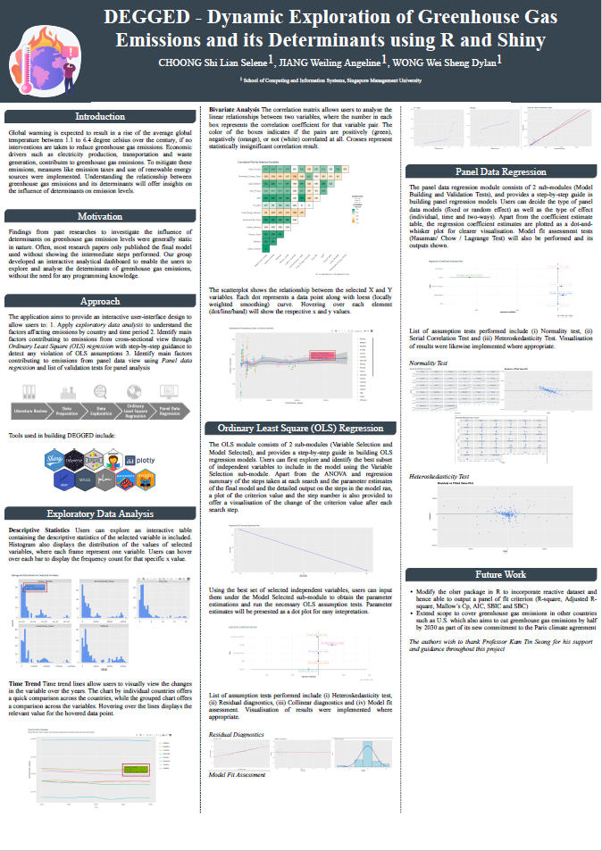

```{r setup, include=FALSE}
knitr::opts_chunk$set(echo = FALSE)
```

```{r, echo=FALSE, message=FALSE, out.width="100%", fig.align="center"}

```

The link to our poster can be found here: https://github.com/awljiang/bloggy/blob/master/Poster.pdf
